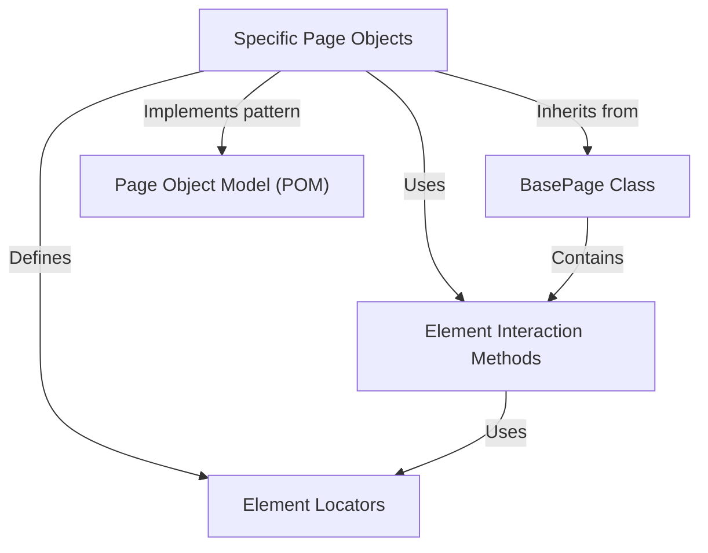
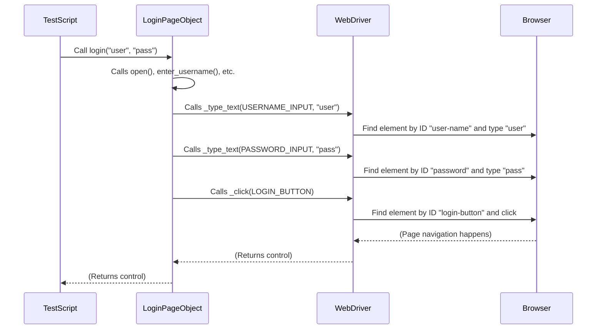
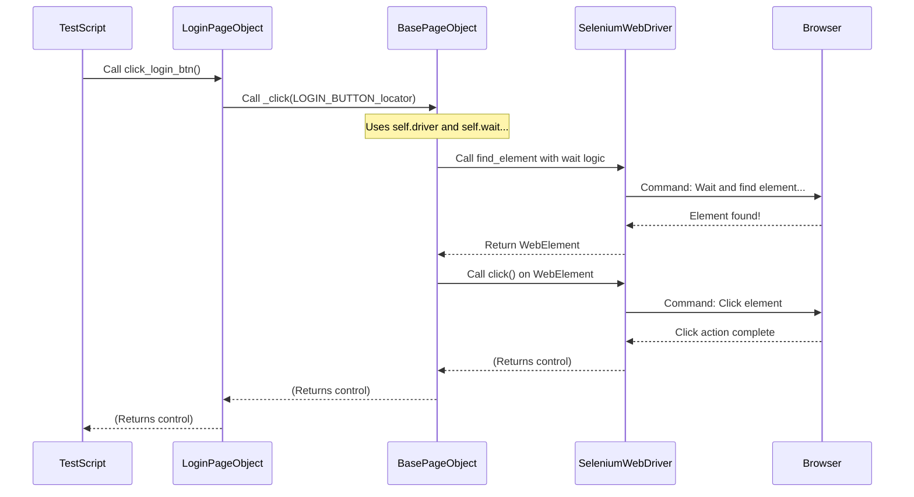

# web-automation-kickstart

This project provides a framework for automating web browser interactions using the **Page Object Model (POM)** design pattern.  
It organizes code by web pages, making tests more *readable* and *maintainable*.  
It includes a shared base class with *reusable methods* for common actions, simplifying interactions with web elements.

> ✅ This framework leverages:
> - **[Selenium](https://www.selenium.dev/)** for browser automation  
> - **[Pytest](https://docs.pytest.org/)** for writing and running test cases  
> - **[SauceDemo](https://www.saucedemo.com/)** as the sample application under test  

---
## 📚 Chapters

- [Visual Overview](#visual-overview)
- [What is the Problem POM Solves?](#what-is-the-problem-pom-solves)
- [Core Concepts of POM](#core-concepts-of-pom)
- [How POM Works Behind the Scenes](#how-pom-works-behind-the-scenes)
- [Common Locator Methods](#common-locator-methods-by)
- [What Problem Does BasePage Solve?](#what-problem-does-basepage-solve)
- [ How it Works Behind the Scenes](#how-it-works-behind-the-scenes)
- [How to Run Locally](#how-to-run-locally)
  
---

## Visual Overview


---
## What is the Problem POM Solves?

Imagine you're writing an automated test to log into a website. Without any structure, your test code might look something like this:

```python
# This is NOT using POM - just an example of the problem!
from selenium.webdriver.common.by import By

# ... code to set up the driver ...

# Directly interacting with elements in the test script
driver.get("https://example.com/login")
username_field = driver.find_element(By.ID, "username")
username_field.send_keys("standard_user")

password_field = driver.find_element(By.ID, "password")
password_field.send_keys("secret_sauce")

login_button = driver.find_element(By.ID, "login-button")
login_button.click()

# ... continue test ...
```
Now, what happens if the website developer decides to change the `id` of the username field from `"username"` to `"user_name"`? You would have to go through *every single test* file that logs in and update that `By.ID` line. This quickly becomes a nightmare as your test suite grows!

Also, just by looking at the test code, it's not immediately obvious *what* page we are on or *what* these interactions mean together. They are just finding elements and doing actions

Let's see how the login example would look with POM:

```python
# This is using POM (simplified)
# Imagine we have a LoginPage class defined elsewhere

# In your test file:
# ... code to set up the driver and initialize the LoginPage ...
# login_page = LoginPage(driver)

login_page.open() # Go to the login page
login_page.login("standard_user", "secret_sauce") # Perform the login action

# ... continue test ...
```

---

## Core Concepts of POM

Let's break down the key ideas within the Page Object Model, as you'll see them implemented in this project:

### 1. Page Object Classes

*   These are Python classes, typically stored in the `pages` directory of this project.
*   Each class represents a single distinct page or significant component of your web application (e.g., `LoginPage`, `InventoryPage`, `CartPage`).
*   They contain two main things:
    *   Information about the **elements** on the page.
    *   Methods that represent **actions** a user can perform on that page.

You can see examples in the project structure: `pages/login_page.py`, `pages/inventory_page.py`, etc.

### 2. Element Locators

*   Inside a Page Object class, you define variables that store *how* to find specific elements on the page (like the username input field).
*   These are often stored as pairs, like `(method, locator_string)`.
*   For example, `(By.ID, "user-name")` means "find the element using its ID, and the ID is 'user-name'".
*   We'll go into much more detail about different types of locators and how they work in the next chapter: [Element Locators](02_element_locators_.md). For now, just know that Page Objects store this crucial "where to find it" information.

In the project code, you'll see this as class variables, like:

```python
# Inside pages/login_page.py (simplified)
class LoginPage:
    USERNAME_INPUT = (By.ID, "user-name") # This is a locator!
    PASSWORD_INPUT = (By.ID, "password") # This is another locator!
    # ... other locators ...
```

### 3. Action Methods

*   These are methods within a Page Object class that perform operations on the page elements.
*   They use the element locators defined in the class to find and interact with elements (e.g., click a button, type text, get text from an element).
*   These methods should represent actions that a *user* would do on the page.

```python
# Inside pages/login_page.py (simplified)
class LoginPage:
    # ... locators defined above ...

    def enter_username(self, username: str):
        # This method uses the USERNAME_INPUT locator
        self._type_text(self.USERNAME_INPUT, username) # _type_text is an internal helper

    def click_login_btn(self):
        # This method uses the LOGIN_BUTTON locator
        self._click(self.LOGIN_BUTTON) # _click is an internal helper

    def login(self, username: str, password: str):
        # This method combines simpler actions
        self.open()
        self.enter_username(username)
        self.enter_password(password)
        self.click_login_btn()
```

This makes your test code much more readable and focused on the business logic (what you're testing) rather than the technical details of finding and interacting with elements.

---
## How POM Works Behind the Scenes

When your test script calls an action method on a Page Object (like `login_page.login(...)`), here's a simplified view of what happens:


Instead of scattering element details and interactions throughout your test scripts, you create a dedicated **"Page Object" class** for each main page (like a Login Page, a Shopping Cart Page, an Inventory Page, etc.).

---
## Common Locator Methods (`By`)

Selenium provides several ways to locate elements using the `By` class. Here are some of the most common ones you'll encounter, starting with the simplest:

| `By` Method        | Description                                                                 | Analogy                          | Example Tuple                     |
| :----------------- | :-------------------------------------------------------------------------- | :------------------------------- | :-------------------------------- |
| `By.ID`            | Locates an element by its `id` attribute. IDs should be unique on a page.   | House Number (Best "Address")    | `(By.ID, "login-button")`         |
| `By.NAME`          | Locates an element by its `name` attribute. May not be unique.              | House Owner's Last Name          | `(By.NAME, "password")`           |
| `By.CLASS_NAME`    | Locates elements by their `class` attribute. Often matches multiple elements. | Houses of a Specific Color       | `(By.CLASS_NAME, "inventory_item")` |
| `By.TAG_NAME`      | Locates elements by their HTML tag name (e.g., `<a>`, `<button>`, `<input>`). | Find all buildings of a certain type (e.g., all "House" buildings) | `(By.TAG_NAME, "input")`          |
| `By.LINK_TEXT`     | Locates a link (`<a>` tag) by its *exact* visible text.                     | Find a shop by its exact sign text | `(By.LINK_TEXT, "Logout")`        |
| `By.PARTIAL_LINK_TEXT` | Locates a link (`<a>` tag) by *partial* visible text.                     | Find a shop by part of its sign text | `(By.PARTIAL_LINK_TEXT, "Log")`   |
| `By.CSS_SELECTOR`  | Locates elements using CSS selector syntax. Very powerful and flexible.     | Complex Address (e.g., "the red building with a blue door") | `(By.CSS_SELECTOR, "div.error-message-container h3")` |
| `By.XPATH`         | Locates elements using XPath expressions. Can navigate the page structure. Also very powerful but can be complex/brittle. | Navigational Directions (e.g., "the third window on the left side") | `(By.XPATH, "//div[@class='title']")` |

---
## What Problem Does BasePage Solve?

When building multiple Page Object classes — like `LoginPage`, `InventoryPage`, `CartPage`, etc. — you’ll notice that many of them require the *same* basic interactions:

- Finding elements using locators
- Clicking elements
- Typing into input fields
- Getting text from elements
- Waiting for elements to become visible or clickable

If every Page Object implemented these actions individually, you'd end up duplicating code in every class — which violates the **DRY (Don't Repeat Yourself)** principle.

### 🔧 Enter `BasePage`: The Shared Utility Class

The `BasePage` class acts like a shared toolbox for all Page Objects. It encapsulates **reusable helper methods** for common web actions, so every page can focus only on what makes it unique.

### 🌟 Core Ideas:

- The `BasePage` (located in `pages/base_page.py`) holds the Selenium driver instance.
- It provides generic utility methods such as:
  - `_find_element(locator)`
  - `_click(locator)`
  - `_type_text(locator, text)`
  - `_get_text(locator)`
  - `_wait_for_element(locator)`
- All specific page classes (like `LoginPage`, `InventoryPage`, etc.) **inherit** from `BasePage`, giving them direct access to these helper methods without duplicating code.

### 🚀 Benefits: 
- ✅ Avoids repetitive code across page classes
- ✅ Makes tests more reliable by handling waits internally
- ✅ Improves readability and maintainability
- ✅ Encourages clean, modular test architecture

With `BasePage`, your Page Object classes become much simpler, cleaner, and focused only on high-level actions.

---
## How it Works Behind the Scenes

When a test script calls a method on a specific Page Object (like `login_page.click_login_btn()`), and that method uses a `BasePage` helper (like `self._click(...)`), here's the flow:


---
## How to Run Locally

Follow these steps to set up and run the automated tests on your local machine.

### Prerequisites

1.  **Python:** Ensure you have Python (version 3.8 or newer recommended) installed. You can download it from [python.org](https://www.python.org/downloads/).
2.  **Git:** You'll need Git to clone the repository. Download it from [git-scm.com](https://git-scm.com/downloads).
3.  **Google Chrome:** The tests are configured to run with Google Chrome. Make sure it's installed on your system.
4.  **ChromeDriver:**
    *   Selenium 4 and later versions include Selenium Manager, which can automatically download the correct ChromeDriver if it's not found in your system's PATH.
    *   If you prefer to manage it manually or encounter issues, download the ChromeDriver version that matches your Google Chrome browser version from [https://chromedriver.chromium.org/downloads](https://chromedriver.chromium.org/downloads).
    *   Ensure the downloaded `chromedriver` executable is in your system's PATH or place it in a known directory.

### Setup Instructions

1.  **Clone the Repository:**
    Open your terminal or command prompt and clone this repository:
    ```bash
    git clone https://github.com/devanshu-kr-jha/web-automation-kickstart
    cd web-automation-kickstart
    ```
    
2.  **Create and Activate a Virtual Environment (Recommended):**
    It's good practice to use a virtual environment to manage project dependencies.
    ```bash
    # For macOS/Linux
    python3 -m venv venv
    source venv/bin/activate

    # For Windows
    python -m venv venv
    .\venv\Scripts\activate
    ```

3.  **Install Dependencies:**
    Install all the required Python packages listed in `requirements.txt`:
    ```bash
    pip install -r requirements.txt
    ```

4.  **Set Up Environment Variables (Optional):**
    The project uses a `.env` file to manage credentials. Default credentials for SauceDemo are already included in the `conftest.py`.
    If you want to use different credentials or explicitly define them:
    *   Copy the example environment file:
        ```bash
        cp .env.example .env
        ```
    *   Edit the `.env` file with your specific SauceDemo credentials if they differ from the defaults:
        ```
        SAUCEDEMO_STANDARD_USER="your_standard_user"
        SAUCEDEMO_LOCKED_OUT_USER="your_locked_out_user"
        SAUCEDEMO_PASSWORD="your_password"
        # ... and other user types if needed
        ```
    If you don't create a `.env` file or the variables are not set, the tests will use the default credentials hardcoded as fallbacks in `conftest.py`.

### Running the Tests

Once the setup is complete, you can run the tests using Pytest.

1.  **Run All Tests:**
    Navigate to the root directory of the project (where `pytest.ini` is located) and run:
    ```bash
    pytest
    ```

2.  **Run Specific Test Files or Classes:**
    ```bash
    # Run all tests in a specific file
    pytest tests/test_saucedemo_flows.py

    # Run all tests in a specific class within a file
    pytest tests/test_saucedemo_flows.py::TestLogin
    ```

3.  **Run Tests with Specific Markers:**
    The `pytest.ini` file defines markers like `smoke`, `regression`, `login`, etc.
    ```bash
    # Run only smoke tests
    pytest -m smoke

    # Run only regression tests
    pytest -m regression

    # Run all tests except smoke tests
    pytest -m "not smoke"

    # To see all available markers
    pytest --markers
    ```

4.  **Run Tests with Verbose Output:**
    ```bash
    pytest -v
    ```

5.  **Generate an HTML Report (if `pytest-html` is installed):**
    If you have `pytest-html` (add it to `requirements.txt` and install if needed), you can generate an HTML report:
    ```bash
    pytest --html=report.html --self-contained-html
    ```
    This will create `report.html` in the root directory, which you can open in a browser.

### After Testing

When you're done, you can deactivate the virtual environment:
```bash
deactivate